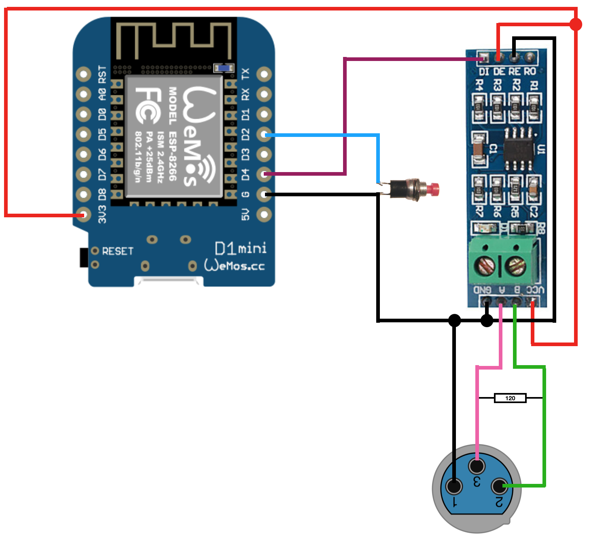
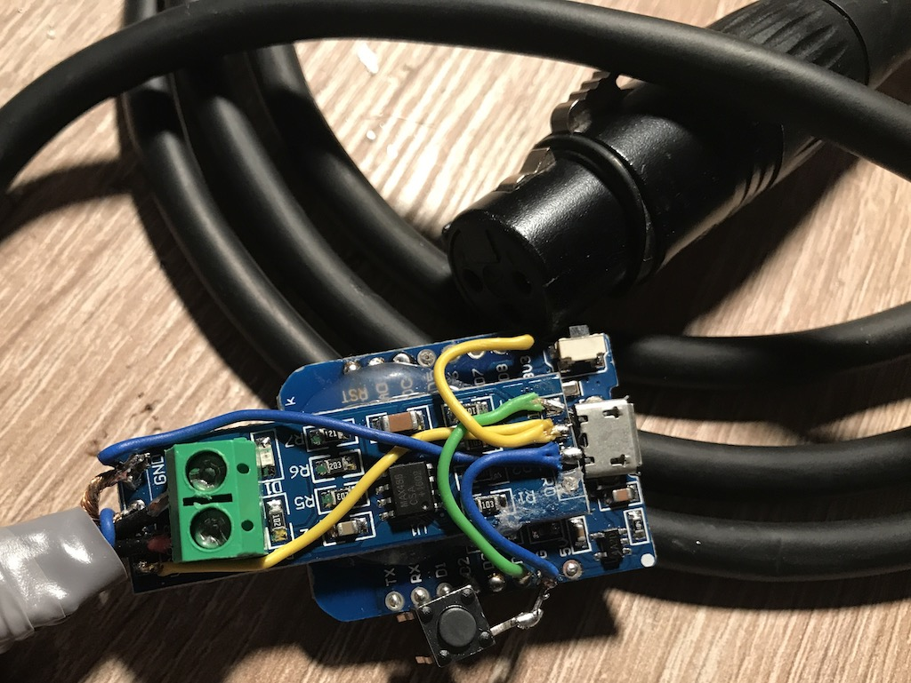

# WemosD1_DMX_Master

## Funktionsübersicht:
Ein einfacher DMX-Master, der als Controller einsetzbar ist und sich mit einfachen UDP-Befehlen steuern lässt.

## Teileliste:
- 1x [Wemos D1 mini](http://www.ebay.de/itm/272271662681) (ca. 3,29 EUR)
- 1x [RS-485 Modul](http://www.ebay.de/itm/252712534559) (ca. 2,29 EUR)
- 1x [XLR Kupplung](http://www.ebay.de/itm/141649245340) (ca. 1,90 EUR)
- 1x [Widerstand 120 Ohm](http://www.ebay.de/itm/321505818922) (ca. 0,10 EUR)
- 1x Stromversorgungsmodul, z.B. [HLK-PM01](http://www.ebay.de/itm/272521453807) (ca. 2,34 EUR) - oder ein 5V Netzteil mit microUSB
- 1x [Taster](http://www.ebay.de/itm/263057910534), wird jedoch nur zur (Erst-)Konfiguration benötigt
(_statt des Tasters kann man auch mit einer temporären Drahtbrücke arbeiten_) 

## Verdrahtung:


**Beispielaufbau**


_Die RS-485 Platine und der Wemos D1 mini sind mit Heißkleber zu einem Modul zusammengeklebt_

## Flashen
Wenn alles nach obigem Bild verdrahtet wurde, kann das Image `WemosD1_DMX_Master.ino.d1_mini.bin` auf den Wemos geflasht werden.

#### Vorgehensweise:
1. Voraussetzungen:
  - CH340-Treiber installieren ([Download-Seite des Herstellers](https://wiki.wemos.cc/downloads))
  - Kommandozeilentool [esptool](https://github.com/igrr/esptool-ck/releases) herunterladen (Windows, Linux Mac) 
  - oder grafisches Tool [ESP8266Flasher](https://esp8266.ru/download/esp8266-utils/esp8266_flasher.zip) herunterladen und entpacken (Windows)
2. Die Dateien esptool.exe und WemosD1_HomeMatic_Helligkeitssensor.ino.d1_mini.bin am besten in einem gemeinsamen Verzeichnis ablegen
3. WemosD1 mit einem microUSB-Kabel an den PC anschließen
4. Bezeichnung des neuen COM-Ports im Gerätemanager notieren (z.B. COM5)
5. a) Flash-Vorgang durchführen (mit ESP8266Flasher):
    - esp8266_flasher.exe mit Doppelklick starten
    - auf den Button "Bin" klicken und heruntergeladene `WemosD1_DMX_Master.ino.d1_mini.bin` auswählen
    - ```COM1``` auf den unter 4. ermittelten COM-Port ändern
    - Wemos D1 vom USB trennen
    - D3 und GND brücken, dabei den Wemos D1 wieder an USB anschließen
    - Download anklicken
5. b) Flash-Vorgang durchführen (mit esptool auf Kommandozeile): 
    - (Windows) Eingabeaufforderung öffnen
    - ins Verzeichnis von esptool/WemosD1_DMX_Master.ino.d1_mini.bin wechseln (cd c:\... usw.)
    - anschließend Flash-Vorgang starten mit
  
`esptool.exe -vv -cd nodemcu -cb 921600 -cp COM5 -ca 0x00000 -cf WemosD1_DMX_Master.ino.d1_mini.bin`

## Konfiguration des Wemos D1
Um den Konfigurationsmodus zu starten, muss der Wemos D1 **mit gedrückt gehaltenem Taster gestartet** werden.
Die **blaue LED am Wifi-Modul blinkt kurz und leuchtet dann dauerhaft.**

**Der Konfigurationsmodus ist nun aktiv.**

Auf dem Handy oder Notebook sucht man nun nach neuen WLAN Netzen in der Umgebung. 

Es erscheint ein neues WLAN mit dem Namen "ESP-DMX-xx:xx:xx:xx:xx:xx"

Nachdem man sich mit diesem verbunden hat, öffnet sich automatisch das Konfigurationsportal.

Geschieht dies nicht automatisch nach ca. 10 Sekunden, ist im Browser die Seite http://192.168.4.1 aufzurufen.

**WLAN konfigurieren auswählen**

**SSID**: WLAN aus der Liste oben auswählen, oder SSID manuell eingeben

**WLAN-Key**: WLAN Passwort

**UDP Port**: gwünschter UDP Port, auf dem Anfragen entgegengenommen werden sollen. Standard: 6674

## Steuerung

Um nun DMX-Geräte zu steuern, müssen lediglich UDP-Pakete im Format **"\<Kanal\>,\<Wert\>;"** an die IP-Adresse des Wemos D1 gesendet werden.

Dies geschieht bspw. mithilfe von `socat`

Beispiel:

Der 
  - Kanal 1 soll den Wert 16
  - Kanal 4 soll den Wert 0
  - Kanal 12 soll den Wert 64
annehmen. So lautet der Aufruf:

`echo "1,16;4,0;12,64;" | /usr/bin/socat - udp-sendto:<IP-des-Wemos>:6674`

oder aus einem HomeMatic-Skript heraus mittels CUxD Exec:

`dom.GetObject("CUxD.CUX2801001:1.CMD_EXEC").State("echo \"1,16;4,0;12,64;\" | /usr/bin/socat - udp-sendto:<IP-des-Wemos>:6674");`

Der Empfang des Pakets wird quittiert mit der Antwort **ACK**

**Wichtig ist, dass nach jedem Wertepaar (Kanal,Wert) ein ";" als Abschlusszeichen folgt (auch, wenn nur ein einzelner Steuerbefehl gesendet werden soll, bspw.**

`echo "11,0;" | /usr/bin/socat - udp-sendto:<IP-des-Wemos>:6674`
